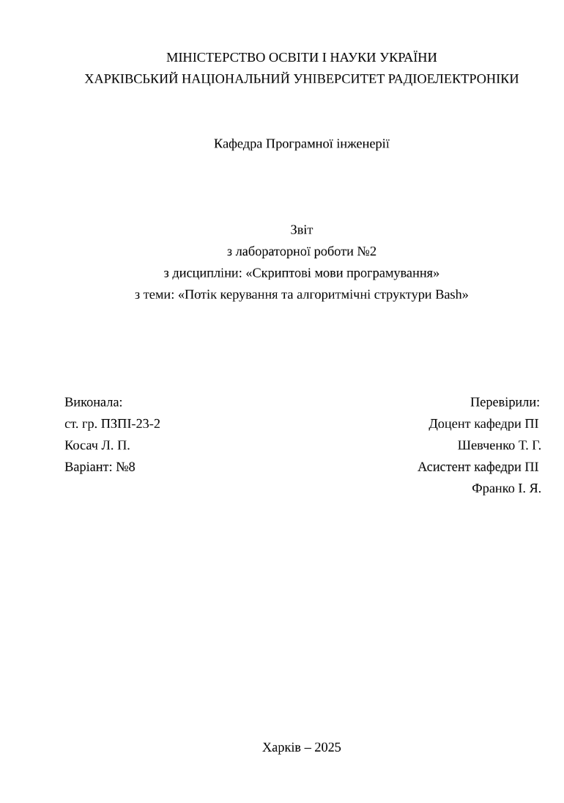

> [!CAUTION]
> Experimental fork. Successfully **breaking** stuff each commit. Documentation is **not** up to date.

# Typst Template for NURE Works


## General Info

This project contains two template functions and some utilities for writing NURE works. All functions include documentation comments inside them, so you can explore all possibilities using LSP.

### Templates

#### `general` - For general works
This template:
- Sets up document styles;
- Formats the title page according to NURE/DSTU guidelines.

#### `coursework` - For Course Works
This template:
- Sets up document styles;
- Formats the title, task, calendar plan, and abstract pages;
- Typesets the bibliography, outline, and appendices according to standard requirements.

### Utilities
- `nheading` - For unnumbered headings, such as "Introduction" and "Conclusion".
- `hfill` - Fills horizontal space with a filled box instead of just empty space; useful for creating underlines.
- `uline` - Creates underlined fields that need to be filled, such as the name field on the task list.
- `bold` - Inserts bold text inside functional environments.
- `img` - Inserts images with a caption, automatically deriving the label from the image file name.

## Usage

### As a local typst package
1. Clone this repository into ~/.local/share/typst/packages/:
```bash
git clone https://github.com/noatu/typst-nure-template.git ~/.local/share/typst/packages/local/nure/0.2.0
```
2. Init your project with Typst:
```bash
typst init @local/nure:0.2.0 project-name
```

### As a standalone file
Copy `lib.typ` to your project's root directory.

### In your project
```typst
// Import the template either from a local package...
#import "@local/nure:0.2.0": *
// ...or by importing a lib.typ directly
// #import "/lib.typ": *

// 1. Setup the document
// by setting values directly...
#show: general.with(
  title: "Some title",
  // etc: "and so on",
  // ...
)
// ...or using a doc.yaml file
#show: general.with(..yaml("doc.yaml"))

// this template automatically inserts a `=title`

// Write your content
#v(-spacing) // remove spacing between headings
== Purpose
Some text

// ...or include your modules
#include "src/intro.typ"
#include "src/chapter1.typ"
#include "src/chapter2.typ"
// NOTE: if you want to use variables or utils provided by the package,
// you have to import the package or a lib.typ inside a module.


// If you ever need appendices in general template use the show rule
// WARNING: when using coursework template use its own argument,
// so it can put bibliography before appendices
#show: appendices-style

= Quote
#link("https://youtu.be/bJQj1uKtnus")[
  The art isn't the art, the art is never the art,
  the art is the thing that happens inside you when you make it and the feeling in the heart of the beholder.
]
```

### Notes:
1. Use `#v(-spacing)` to remove vertical spacing between titles (this cannot be automatically handled by the template). Variable `spacing` used here is imported from the template.
2. When importing `@local/nure:0.2.0` and specifying file paths in functions handled by the package, the path will relative to package's root directory, e.g. setting `#show: coursework.with(bib_path: "bibl.yml")` will evaluate to `~/.local/share/typst/packages/local/nure/0.2.0/bibl.yml`, the same is for `#img` function, which makes it quite annoying and forces one to import `lib.typ` file. Please open an issue or contact us in any other way if you have any advice.

### Example Project Structure
```
project/
├── main.typ -- for boilerplate code and importing everything 
├── src/
│   ├── intro.typ
│   ├── chapter1.typ
│   ├── chapter2.typ
│   └── ...
├── figures/
│   ├── chapter1/
│   │   ├── figure1.png
│   │   ├── figure2.png
│   │   ├── figure3.png
│   │   └── ...
│   ├── chapter2/
│   │   ├── figure1.png
│   │   ├── figure2.png
│   │   ├── figure3.png
│   │   └── ...
│   └── ...
└── ...
```
